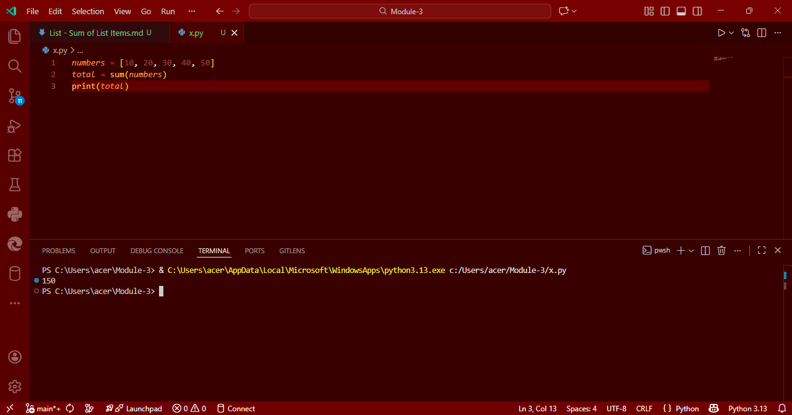

# List Operations in Python: Sum of List Items

## Aim
To write a Python program that calculates the **sum of all elements** in a list.

## Algorithm
1. Define a list of numbers.
2. Use Python’s built-in `sum()` function to calculate the total.
3. Print the result.

## Program
```
numbers = [10, 20, 30, 40, 50]
total = sum(numbers)
print(total)
```

## Output


## Result
Thus, the Python program to find the sum of all elements in a list is executed successfully.