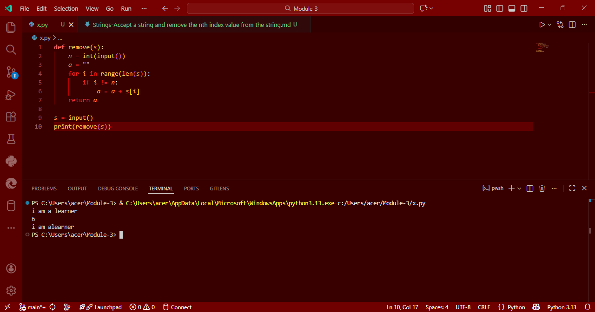

# Strings-Remove Nth Index Character from a String

## Aim
To write a Python program that accepts a string and removes the character at a specified index.

## Algorithm
1. Define a function named `remove` that takes the input string as an argument.
2. Read the index `n` from the user input.
3. Initialize an empty string `a` to store the new string.
4. Iterate over each index of the string using a `for` loop.
5. Check if the current index `i` is not equal to `n`.
6. If `i != n`, append the character at index `i` to string `a`.
7. After the loop, return the modified string `a`.
8. Print the final result.

## Program
```
def remove(s):
    n = int(input())
    a = ""
    for i in range(len(s)):
        if i != n:
            a = a + s[i]
    return a

s = input()
print(remove(s))
```
## Output


## Result
Thus, the Python program to remove the character at the given index from a string is executed successfully.