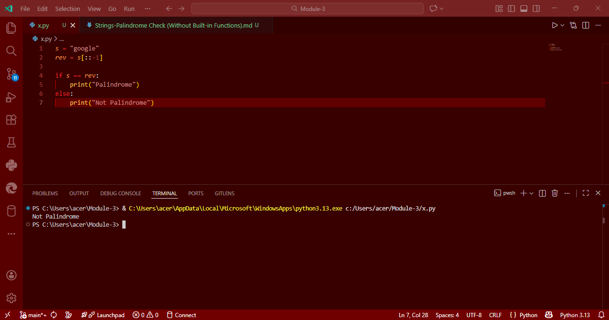

# Strings-Palindrome Check in Python (Without Built-in Functions)

## Aim
To write a Python program to check whether the string `"google"` is a **palindrome** or not, without using built-in palindrome checking functions.

## Algorithm
1. Assign the string `"google"` to a variable.
2. Reverse the string manually using slicing (`[::-1]`).
3. Compare the original string with the reversed string.
   - If they are equal, print that the string is a palindrome.
   - Otherwise, print that it is not a palindrome.
4. Execute the program.

## Program
```
s = "google"
rev = s[::-1]

if s == rev:
    print("Palindrome")
else:
    print("Not Palindrome")
```
## Output


## Result
Thus, the Python program to check whether a string is a palindrome without using built-in functions is executed successfully.