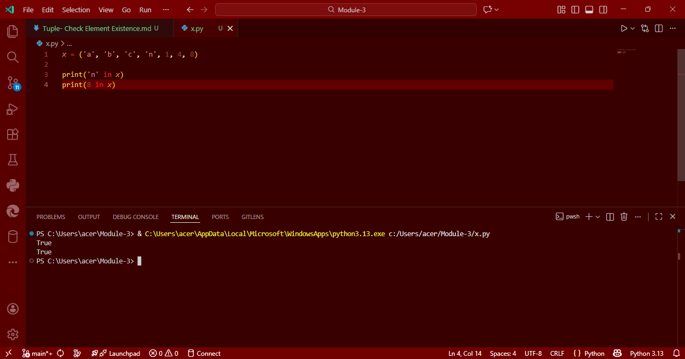

# Tuple in Python: Check Element Existence

## Aim
To write a Python program that checks if the element `'n'` and the element `8` exist within a given tuple.

## Algorithm
1. Define a tuple `x` with some letters and numbers.
2. Use the `in` operator to check if the string `'n'` exists within the tuple.
3. Use the `in` operator to check if the integer `8` exists within the tuple.
4. Print the results.

## Program
```
x = ('a', 'b', 'c', 'n', 1, 4, 8)

print('n' in x)
print(8 in x)
```

## Output


## Result
Thus, the Python program to check the existence of elements in a tuple is executed successfully.